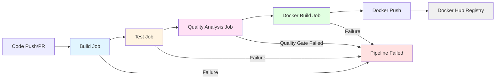
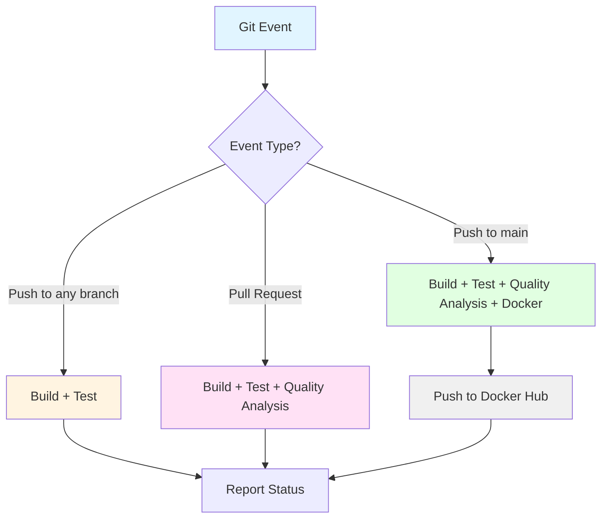
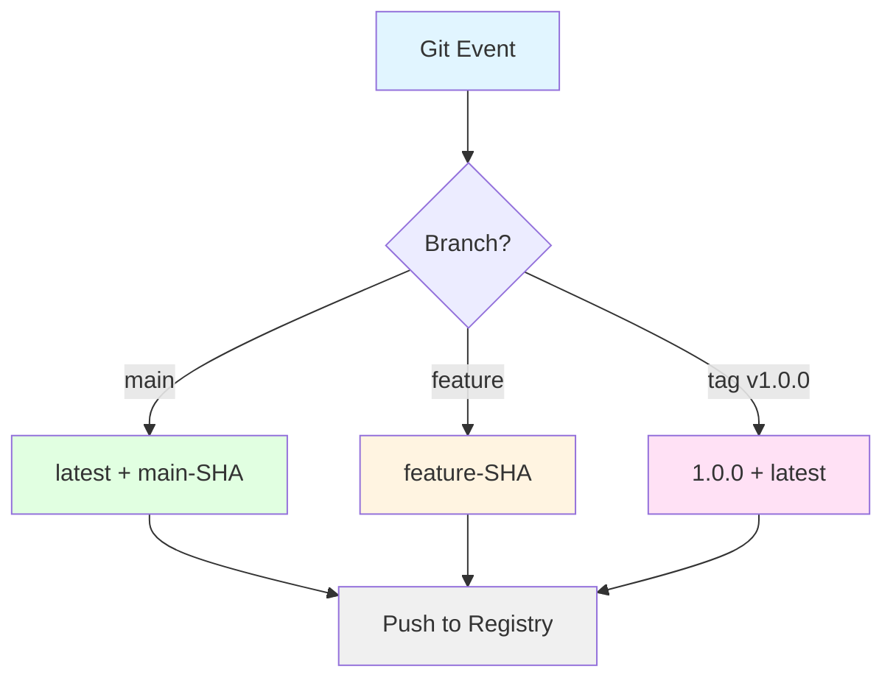
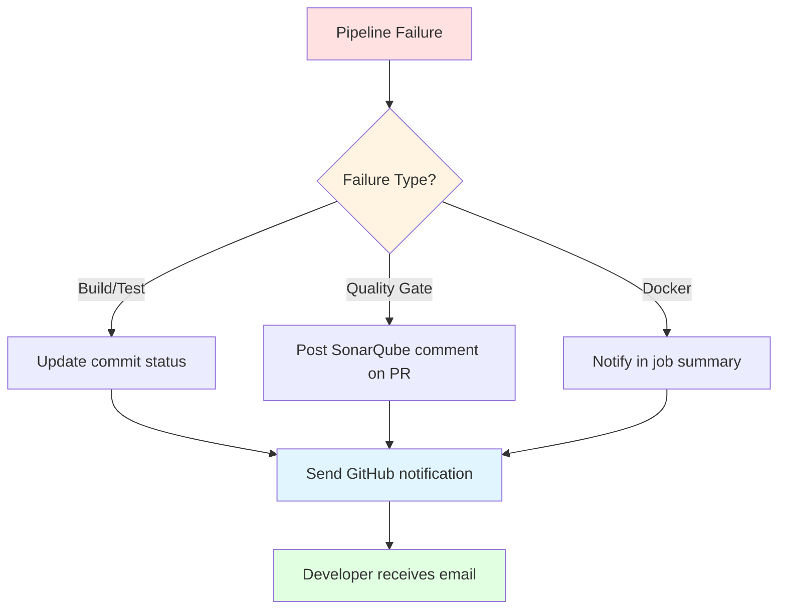

# Design Document: CI/CD Pipeline Integration

## Overview

This design document specifies the technical architecture and implementation details for a comprehensive CI/CD pipeline for the evaluation-service Spring Boot microservice. The pipeline automates the entire software delivery lifecycle from code commit to Docker image publication, incorporating automated testing, code coverage analysis, quality gates, and containerization.

### System Context

The evaluation-service is a Spring Boot 3.2.0 microservice built with Java 21 and Maven, running on port 8089. It uses MySQL for production data storage and H2 for testing. The service is part of a microservices architecture registered with Eureka service discovery.

### Design Goals

1. **Automation**: Eliminate manual build, test, and deployment steps
2. **Quality Assurance**: Enforce code coverage thresholds (80% line, 70% branch) and quality gates
3. **Fast Feedback**: Provide developers with build results in under 5 minutes
4. **Security**: Manage sensitive credentials securely using GitHub secrets
5. **Consistency**: Ensure reproducible builds across environments using Docker
6. **Traceability**: Tag Docker images with Git commit information for version tracking

### Technology Stack

- **CI/CD Platform**: GitHub Actions
- **Build Tool**: Maven 3.9.x
- **Code Coverage**: JaCoCo Maven Plugin
- **Quality Analysis**: SonarQube with Maven Scanner
- **Containerization**: Docker with multi-stage builds
- **Base Images**: eclipse-temurin:21-jdk-alpine (build), eclipse-temurin:21-jre-alpine (runtime)
- **Container Registry**: Docker Hub

## Architecture

### Pipeline Architecture

The CI/CD pipeline consists of four sequential stages with dependency management to fail fast and conserve resources:



### Workflow Trigger Strategy



### Job Dependency Flow

Each job depends on the successful completion of the previous job:

1. **Build Job**: Compiles source code, resolves dependencies
2. **Test Job**: Executes unit tests with H2, generates coverage data (depends on Build)
3. **Quality Analysis Job**: Runs SonarQube scanner, enforces quality gates (depends on Test)
4. **Docker Build Job**: Creates and pushes Docker image (depends on Quality Analysis, main branch only)

## Components and Interfaces

### 1. Maven POM Configuration

#### JaCoCo Plugin Configuration

The JaCoCo plugin will be added to the `pom.xml` build section with the following configuration:

```xml
<plugin>
    <groupId>org.jacoco</groupId>
    <artifactId>jacoco-maven-plugin</artifactId>
    <version>0.8.11</version>
    <executions>
        <!-- Prepare agent for test execution -->
        <execution>
            <id>prepare-agent</id>
            <goals>
                <goal>prepare-agent</goal>
            </goals>
        </execution>
        <!-- Generate coverage report -->
        <execution>
            <id>report</id>
            <phase>verify</phase>
            <goals>
                <goal>report</goal>
            </goals>
        </execution>
        <!-- Enforce coverage thresholds -->
        <execution>
            <id>check</id>
            <phase>verify</phase>
            <goals>
                <goal>check</goal>
            </goals>
            <configuration>
                <rules>
                    <rule>
                        <element>BUNDLE</element>
                        <limits>
                            <limit>
                                <counter>LINE</counter>
                                <value>COVEREDRATIO</value>
                                <minimum>0.80</minimum>
                            </limit>
                            <limit>
                                <counter>BRANCH</counter>
                                <value>COVEREDRATIO</value>
                                <minimum>0.70</minimum>
                            </limit>
                        </limits>
                    </rule>
                </rules>
            </configuration>
        </execution>
    </executions>
</plugin>
```

**Key Configuration Points**:
- `prepare-agent`: Instruments bytecode during test execution
- `report`: Generates HTML and XML reports in `target/site/jacoco/`
- `check`: Enforces 80% line coverage and 70% branch coverage thresholds
- Failure to meet thresholds causes Maven build to fail

#### SonarQube Plugin Configuration

The SonarQube Maven plugin will be added to the `pom.xml`:

```xml
<plugin>
    <groupId>org.sonarsource.scanner.maven</groupId>
    <artifactId>sonar-maven-plugin</artifactId>
    <version>3.10.0.2594</version>
</plugin>
```

**Properties for SonarQube**:
```xml
<properties>
    <sonar.organization>your-org</sonar.organization>
    <sonar.host.url>https://sonarcloud.io</sonar.host.url>
    <sonar.coverage.jacoco.xmlReportPaths>target/site/jacoco/jacoco.xml</sonar.coverage.jacoco.xmlReportPaths>
    <sonar.java.source>21</sonar.java.source>
</properties>
```

### 2. GitHub Actions Workflow

#### Workflow File Structure

**File Location**: `.github/workflows/ci-cd.yml`

```yaml
name: CI/CD Pipeline

on:
  push:
    branches:
      - '**'
  pull_request:
    branches:
      - '**'

env:
  JAVA_VERSION: '21'
  MAVEN_VERSION: '3.9.6'
  DOCKER_IMAGE_NAME: your-dockerhub-username/evaluation-service

jobs:
  build:
    name: Build Application
    runs-on: ubuntu-latest
    
    steps:
      - name: Checkout code
        uses: actions/checkout@v4
        
      - name: Set up JDK 21
        uses: actions/setup-java@v4
        with:
          java-version: '21'
          distribution: 'temurin'
          cache: 'maven'
          
      - name: Build with Maven
        run: mvn clean compile -DskipTests
        
      - name: Upload build artifacts
        uses: actions/upload-artifact@v4
        with:
          name: build-artifacts-${{ github.run_number }}
          path: target/
          retention-days: 30

  test:
    name: Run Tests and Generate Coverage
    runs-on: ubuntu-latest
    needs: build
    
    steps:
      - name: Checkout code
        uses: actions/checkout@v4
        
      - name: Set up JDK 21
        uses: actions/setup-java@v4
        with:
          java-version: '21'
          distribution: 'temurin'
          cache: 'maven'
          
      - name: Run tests with coverage
        run: mvn verify
        
      - name: Upload test reports
        if: always()
        uses: actions/upload-artifact@v4
        with:
          name: test-reports-${{ github.run_number }}
          path: target/surefire-reports/
          retention-days: 30
          
      - name: Upload coverage reports
        uses: actions/upload-artifact@v4
        with:
          name: coverage-reports-${{ github.run_number }}
          path: target/site/jacoco/
          retention-days: 30
          
      - name: Generate test summary
        if: always()
        run: |
          echo "## Test Results" >> $GITHUB_STEP_SUMMARY
          echo "Coverage reports generated in target/site/jacoco/" >> $GITHUB_STEP_SUMMARY

  quality-analysis:
    name: SonarQube Analysis
    runs-on: ubuntu-latest
    needs: test
    if: github.event_name == 'pull_request' || github.ref == 'refs/heads/main'
    
    steps:
      - name: Checkout code
        uses: actions/checkout@v4
        with:
          fetch-depth: 0  # Shallow clones disabled for better analysis
          
      - name: Set up JDK 21
        uses: actions/setup-java@v4
        with:
          java-version: '21'
          distribution: 'temurin'
          cache: 'maven'
          
      - name: Cache SonarQube packages
        uses: actions/cache@v3
        with:
          path: ~/.sonar/cache
          key: ${{ runner.os }}-sonar
          restore-keys: ${{ runner.os }}-sonar
          
      - name: Run SonarQube analysis
        env:
          SONAR_TOKEN: ${{ secrets.SONAR_TOKEN }}
          SONAR_HOST_URL: ${{ secrets.SONAR_HOST_URL }}
        run: |
          mvn verify sonar:sonar \
            -Dsonar.token=$SONAR_TOKEN \
            -Dsonar.host.url=$SONAR_HOST_URL \
            -Dsonar.projectKey=evaluation-service \
            -Dsonar.projectName=evaluation-service
            
      - name: Check Quality Gate
        uses: sonarsource/sonarqube-quality-gate-action@master
        timeout-minutes: 5
        env:
          SONAR_TOKEN: ${{ secrets.SONAR_TOKEN }}
          SONAR_HOST_URL: ${{ secrets.SONAR_HOST_URL }}

  docker-build:
    name: Build and Push Docker Image
    runs-on: ubuntu-latest
    needs: quality-analysis
    if: github.ref == 'refs/heads/main'
    
    steps:
      - name: Checkout code
        uses: actions/checkout@v4
        
      - name: Set up JDK 21
        uses: actions/setup-java@v4
        with:
          java-version: '21'
          distribution: 'temurin'
          cache: 'maven'
          
      - name: Build JAR
        run: mvn clean package -DskipTests
        
      - name: Set up Docker Buildx
        uses: docker/setup-buildx-action@v3
        
      - name: Log in to Docker Hub
        uses: docker/login-action@v3
        with:
          username: ${{ secrets.DOCKER_USERNAME }}
          password: ${{ secrets.DOCKER_PASSWORD }}
          
      - name: Extract metadata
        id: meta
        uses: docker/metadata-action@v5
        with:
          images: ${{ env.DOCKER_IMAGE_NAME }}
          tags: |
            type=sha,prefix={{branch}}-
            type=raw,value=latest,enable={{is_default_branch}}
            type=ref,event=tag
            
      - name: Build and push Docker image
        uses: docker/build-push-action@v5
        with:
          context: .
          push: true
          tags: ${{ steps.meta.outputs.tags }}
          labels: ${{ steps.meta.outputs.labels }}
          cache-from: type=gha
          cache-to: type=gha,mode=max
          
      - name: Generate Docker summary
        run: |
          echo "## Docker Image Published" >> $GITHUB_STEP_SUMMARY
          echo "**Tags:**" >> $GITHUB_STEP_SUMMARY
          echo "${{ steps.meta.outputs.tags }}" >> $GITHUB_STEP_SUMMARY
          echo "**Commit:** ${{ github.sha }}" >> $GITHUB_STEP_SUMMARY
```

#### Workflow Execution Matrix

| Event Type | Build | Test | Quality Analysis | Docker Build |
|------------|-------|------|------------------|--------------|
| Push to feature branch | ✓ | ✓ | ✗ | ✗ |
| Pull Request | ✓ | ✓ | ✓ | ✗ |
| Push to main | ✓ | ✓ | ✓ | ✓ |

### 3. Dockerfile Design

#### Multi-Stage Build Structure

```dockerfile
# Stage 1: Build stage
FROM eclipse-temurin:21-jdk-alpine AS builder

# Set working directory
WORKDIR /app

# Copy Maven wrapper and pom.xml first for dependency caching
COPY .mvn/ .mvn/
COPY mvnw pom.xml ./

# Download dependencies (cached layer)
RUN ./mvnw dependency:go-offline -B

# Copy source code
COPY src ./src

# Build application
RUN ./mvnw clean package -DskipTests -B

# Stage 2: Runtime stage
FROM eclipse-temurin:21-jre-alpine

# Create non-root user
RUN addgroup -S spring && adduser -S spring -G spring

# Set working directory
WORKDIR /app

# Copy JAR from builder stage
COPY --from=builder /app/target/*.jar app.jar

# Change ownership to non-root user
RUN chown spring:spring app.jar

# Switch to non-root user
USER spring:spring

# Expose application port
EXPOSE 8089

# Health check configuration
HEALTHCHECK --interval=30s --timeout=3s --start-period=60s --retries=3 \
  CMD wget --no-verbose --tries=1 --spider http://localhost:8089/actuator/health || exit 1

# Environment variables with defaults
ENV SPRING_DATASOURCE_URL=jdbc:mysql://localhost:3306/evaluation?createDatabaseIfNotExist=true&useUnicode=true&useJDBCCompliantTimezoneShift=true&useLegacyDatetimeCode=false&serverTimezone=UTC \
    SPRING_DATASOURCE_USERNAME=root \
    SPRING_DATASOURCE_PASSWORD= \
    EUREKA_CLIENT_SERVICE_URL_DEFAULTZONE=http://localhost:8761/eureka \
    SERVER_PORT=8089

# Run application
ENTRYPOINT ["java", "-jar", "app.jar"]
```

#### Dockerfile Optimization Strategies

1. **Layer Caching**: Dependencies downloaded before source code copy
2. **Multi-Stage Build**: Build artifacts not included in final image
3. **Minimal Base Image**: Alpine Linux reduces image size
4. **Non-Root User**: Security best practice
5. **Health Check**: Kubernetes/Docker Swarm readiness probe

**Expected Image Size**: < 300MB

### 4. SonarQube Quality Gate Configuration

#### Quality Gate Conditions

The following quality gate conditions will be configured in SonarQube:

| Metric | Condition | Threshold | Applies To |
|--------|-----------|-----------|------------|
| Bugs | is less than | 1 | New Code |
| Vulnerabilities | is less than | 1 | New Code |
| Security Hotspots Reviewed | is greater than | 100% | New Code |
| Code Smells | is less than | 10 | New Code |
| Coverage | is greater than | 80% | New Code |
| Duplicated Lines | is less than | 3% | New Code |
| Maintainability Rating | is better than | B | New Code |
| Reliability Rating | is better than | A | New Code |
| Security Rating | is better than | A | New Code |

#### SonarQube Project Configuration

**Project Key**: `evaluation-service`
**Project Name**: `Evaluation Service`
**Analysis Scope**: `src/main/java/**/*.java`
**Exclusions**: `src/test/**`, `target/**`, `**/*Test.java`

### 5. GitHub Secrets Configuration

The following secrets must be configured in the GitHub repository settings:

| Secret Name | Description | Example Value |
|-------------|-------------|---------------|
| `SONAR_TOKEN` | SonarQube authentication token | `sqp_1234567890abcdef` |
| `SONAR_HOST_URL` | SonarQube server URL | `https://sonarcloud.io` |
| `DOCKER_USERNAME` | Docker Hub username | `your-username` |
| `DOCKER_PASSWORD` | Docker Hub password or access token | `dckr_pat_xxxxx` |

### 6. Docker Image Tagging Strategy

#### Tagging Rules



**Tag Format Examples**:
- Commit on main: `latest`, `main-a1b2c3d`
- Commit on feature: `feature-branch-a1b2c3d`
- Git tag v1.2.3: `1.2.3`, `latest`

## Data Models

### Pipeline Execution Context

```yaml
PipelineContext:
  gitCommitSha: string          # Git commit SHA (7 characters)
  gitBranch: string             # Git branch name
  gitTag: string?               # Git tag if present
  buildNumber: integer          # GitHub Actions run number
  triggeredBy: string           # GitHub username
  eventType: enum               # push | pull_request | tag
  
BuildArtifacts:
  jarFile: string               # Path to compiled JAR
  testReports: string[]         # Paths to JUnit XML reports
  coverageReports: string[]     # Paths to JaCoCo HTML/XML reports
  
QualityMetrics:
  lineCoverage: float           # Percentage (0-100)
  branchCoverage: float         # Percentage (0-100)
  bugs: integer                 # SonarQube bug count
  vulnerabilities: integer      # SonarQube vulnerability count
  codeSmells: integer           # SonarQube code smell count
  technicalDebt: string         # Time estimate (e.g., "2h 30min")
  qualityGateStatus: enum       # PASSED | FAILED
  
DockerImageMetadata:
  repository: string            # Docker Hub repository
  tags: string[]                # List of applied tags
  digest: string                # Image SHA256 digest
  size: integer                 # Image size in bytes
  createdAt: timestamp          # Build timestamp
```

## Error Handling

### Build Failure Scenarios

| Failure Type | Detection Point | Action | Recovery |
|--------------|----------------|--------|----------|
| Compilation Error | Build Job | Fail pipeline, display compiler errors | Fix code, push new commit |
| Test Failure | Test Job | Fail pipeline, upload test reports | Fix failing tests, push new commit |
| Coverage Below Threshold | Test Job (verify phase) | Fail pipeline, display coverage report | Add tests to increase coverage |
| Quality Gate Failure | Quality Analysis Job | Fail pipeline, link to SonarQube | Fix code issues, push new commit |
| Docker Build Failure | Docker Build Job | Fail pipeline, display Docker logs | Fix Dockerfile or build context |
| Docker Push Failure | Docker Build Job | Fail pipeline, check credentials | Verify Docker Hub credentials |

### Error Notification Strategy



### Retry and Timeout Configuration

| Job | Timeout | Retry Strategy |
|-----|---------|----------------|
| Build | 10 minutes | No automatic retry |
| Test | 15 minutes | No automatic retry |
| Quality Analysis | 10 minutes | Retry once on SonarQube connection failure |
| Docker Build | 20 minutes | No automatic retry |

## Testing Strategy

This feature involves Infrastructure as Code (IaC) and CI/CD configuration, which is **not suitable for property-based testing**. The design focuses on declarative configuration (GitHub Actions YAML, Dockerfile, Maven POM) rather than algorithmic logic with universal properties.

### Testing Approach

#### 1. Configuration Validation Tests

**Unit Tests for Configuration Parsing**:
- Validate GitHub Actions YAML syntax
- Validate Dockerfile syntax
- Validate Maven POM XML structure
- Test: Parse workflow file and verify job definitions exist
- Test: Parse Dockerfile and verify multi-stage structure
- Test: Parse pom.xml and verify JaCoCo plugin configuration

#### 2. Integration Tests

**Pipeline Integration Tests**:
- Test: Trigger workflow on push event, verify build job executes
- Test: Trigger workflow on PR event, verify quality analysis runs
- Test: Verify Maven build produces JAR artifact
- Test: Verify JaCoCo generates coverage reports in target/site/jacoco/
- Test: Verify Docker image builds successfully
- Test: Verify Docker image contains correct JAR file

**Docker Container Tests**:
- Test: Start container, verify application starts on port 8089
- Test: Health check endpoint returns 200 OK
- Test: Container runs as non-root user
- Test: Environment variables override application.properties

#### 3. Smoke Tests

**Post-Deployment Smoke Tests**:
- Test: Pipeline completes successfully on sample commit
- Test: Docker image tagged with commit SHA exists in registry
- Test: SonarQube project exists and has analysis results
- Test: Coverage reports uploaded as GitHub artifacts

#### 4. Manual Verification Checklist

- [ ] GitHub Actions workflow appears in Actions tab
- [ ] Build status badge displays in README
- [ ] SonarQube quality gate status visible in PR
- [ ] Docker image pullable from Docker Hub
- [ ] All required GitHub secrets configured
- [ ] Pipeline completes in under 5 minutes for typical changes

### Test Execution Strategy

**Local Testing**:
- Use `act` tool to test GitHub Actions workflows locally
- Use `docker build` to test Dockerfile locally
- Use `mvn verify` to test JaCoCo configuration locally

**CI Testing**:
- Create test branch and trigger pipeline
- Verify each job completes successfully
- Check artifacts uploaded correctly
- Validate Docker image functionality

### Coverage Goals

Since this is infrastructure configuration, traditional code coverage metrics don't apply. Instead, we measure:

- **Configuration Coverage**: All requirements have corresponding configuration
- **Integration Coverage**: All jobs tested end-to-end
- **Error Path Coverage**: All failure scenarios tested

## Implementation Notes

### Prerequisites

1. **GitHub Repository Setup**:
   - Repository must have Actions enabled
   - Branch protection rules configured for main branch
   - Required secrets configured

2. **SonarQube Setup**:
   - SonarQube project created
   - Quality gate configured with specified conditions
   - Authentication token generated

3. **Docker Hub Setup**:
   - Docker Hub account created
   - Repository created for evaluation-service
   - Access token generated

### Implementation Order

1. **Phase 1: Maven Configuration**
   - Add JaCoCo plugin to pom.xml
   - Add SonarQube plugin to pom.xml
   - Test locally with `mvn verify`

2. **Phase 2: Dockerfile Creation**
   - Create multi-stage Dockerfile
   - Test locally with `docker build`
   - Verify image size < 300MB

3. **Phase 3: GitHub Actions Workflow**
   - Create `.github/workflows/ci-cd.yml`
   - Implement build and test jobs
   - Test with feature branch push

4. **Phase 4: SonarQube Integration**
   - Configure GitHub secrets
   - Add quality-analysis job
   - Test with pull request

5. **Phase 5: Docker Integration**
   - Add docker-build job
   - Configure Docker Hub credentials
   - Test with main branch push

### Performance Optimization

**Maven Dependency Caching**:
```yaml
- uses: actions/setup-java@v4
  with:
    cache: 'maven'
```

**Docker Layer Caching**:
```yaml
- uses: docker/build-push-action@v5
  with:
    cache-from: type=gha
    cache-to: type=gha,mode=max
```

**SonarQube Package Caching**:
```yaml
- uses: actions/cache@v3
  with:
    path: ~/.sonar/cache
    key: ${{ runner.os }}-sonar
```

### Security Considerations

1. **Secret Management**: All sensitive data stored in GitHub secrets
2. **Non-Root Container**: Docker container runs as non-root user
3. **Dependency Scanning**: SonarQube scans for vulnerable dependencies
4. **Image Scanning**: Consider adding Trivy or Snyk for container scanning
5. **Least Privilege**: Docker Hub token has minimal required permissions

### Monitoring and Observability

**Pipeline Metrics to Track**:
- Average pipeline execution time
- Pipeline success rate
- Test failure rate
- Coverage trend over time
- Quality gate pass rate
- Docker image size trend

**Alerting**:
- Pipeline failures on main branch
- Quality gate failures
- Coverage drops below threshold
- Docker push failures

## Appendix

### Maven Command Reference

```bash
# Compile only
mvn clean compile

# Run tests with coverage
mvn clean verify

# Run SonarQube analysis
mvn clean verify sonar:sonar \
  -Dsonar.token=$SONAR_TOKEN \
  -Dsonar.host.url=$SONAR_HOST_URL

# Package without tests
mvn clean package -DskipTests
```

### Docker Command Reference

```bash
# Build image locally
docker build -t evaluation-service:local .

# Run container locally
docker run -d \
  -p 8089:8089 \
  -e SPRING_DATASOURCE_URL=jdbc:mysql://host.docker.internal:3306/evaluation \
  -e EUREKA_CLIENT_SERVICE_URL_DEFAULTZONE=http://host.docker.internal:8761/eureka \
  evaluation-service:local

# Check container health
docker ps
docker logs <container-id>
docker exec <container-id> wget -O- http://localhost:8089/actuator/health
```

### GitHub Actions Command Reference

```bash
# Test workflow locally with act
act push -j build

# View workflow runs
gh run list

# View specific run logs
gh run view <run-id> --log

# Re-run failed jobs
gh run rerun <run-id> --failed
```

### Troubleshooting Guide

**Issue**: Maven build fails with "dependencies not found"
**Solution**: Clear Maven cache, verify internet connectivity

**Issue**: JaCoCo coverage check fails
**Solution**: Run `mvn verify` locally, review coverage report in `target/site/jacoco/index.html`

**Issue**: SonarQube quality gate fails
**Solution**: Check SonarQube dashboard for specific issues, fix code smells/bugs

**Issue**: Docker build fails with "no space left on device"
**Solution**: Clean up Docker images with `docker system prune -a`

**Issue**: Docker push fails with authentication error
**Solution**: Verify DOCKER_USERNAME and DOCKER_PASSWORD secrets are correct

---

**Document Version**: 1.0  
**Last Updated**: 2024  
**Status**: Ready for Review
